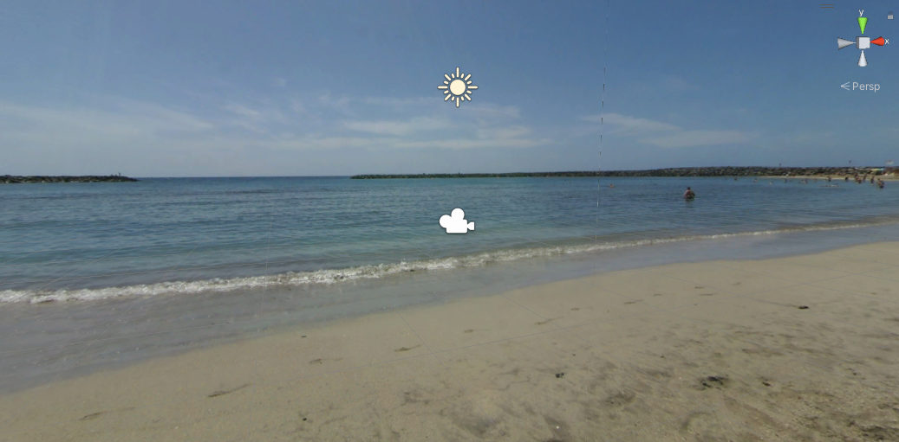
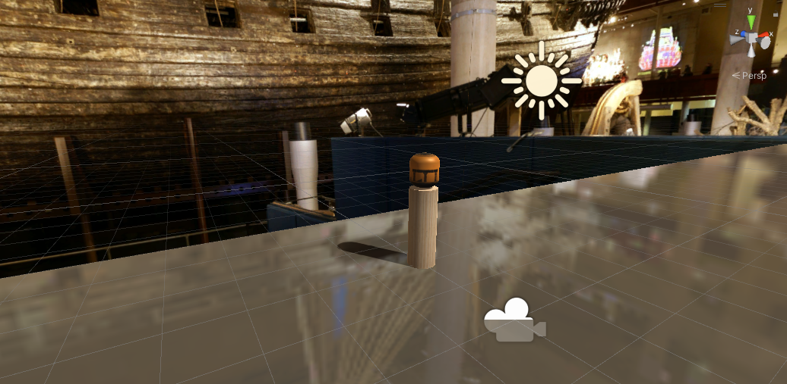
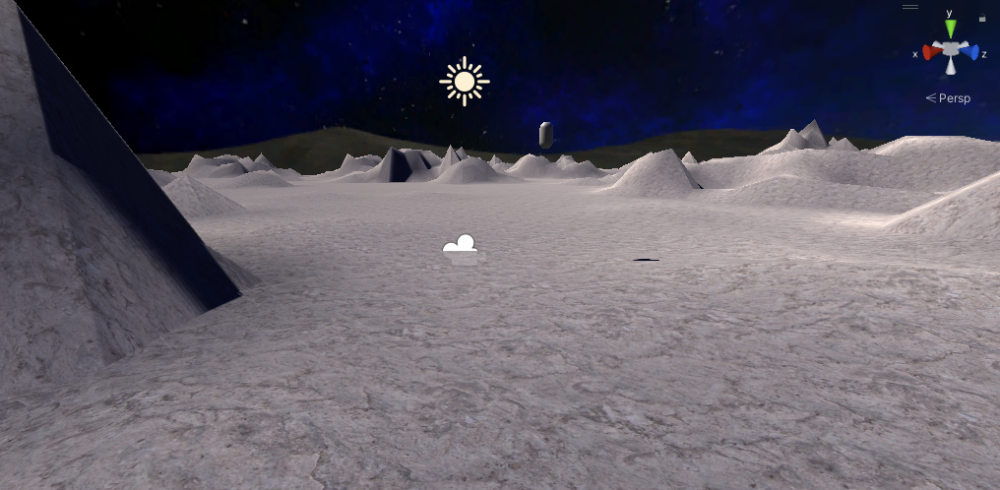

# Rhaptor

Full details on the code development and research that went into this project, are captured on this [website](https://kevinyr3.notion.site/Wearable-Haptics-487e04ca004545e68f32e6a06ef6b1ed).

This repository contains the main source code files relevant to my project. I have uploaded:

* My 3 Unity 3D Environments (The projects were too large, even after compression. Since almsot all the relevant scirpts I used to build the RHapTor interface was in the Assets Folder of each environemnt, only they were uploaded. ) The C# scripts used to write components for the interface between Unity and Arduino can be found in the `Assets/Script` folder of a given virtual environemnet in the `VR_Worlds` folder. I have also included the `log.txt` file in the `Script` subdirectory which had the raw tracking data my C# scripts picked form the last participant, full dataset available in Data Analysis folder. Full VR environemnts available on [this](https://drive.google.com/drive/folders/1tph_LBkmk3lDrchsNHONTKINAlR3lUr4?usp=sharing) google drive
* My Arduino Sketches from the development of my haptic rendering algorithms. `final.ino` contains the script with all algorithms.
* Representative figrues of my work
* Python Data Analysis Scripts

## Environments
Environemnts available on [Google Drive](https://drive.google.com/drive/folders/1tph_LBkmk3lDrchsNHONTKINAlR3lUr4?usp=sharing).
While the Unity environemnets cannot be loaded from just the Assets, screenshots of the environemnets have been included below:

## Demo

